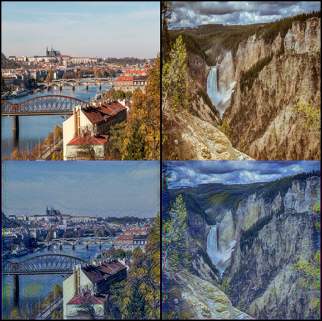

## neural-style-transfer-pytorch
This repository is a deep-running part of a program that changes the style of a photo. And I refer to the following paper.  
[A Neural Algorithm of Artistic Style](https://arxiv.org/abs/1508.06576)

## How to train
Put images that you want to copy style in directory 'style'
```
style/
    vangogh.jpg
    monet.jpg
```
run main file
```bash
python main.py --style_image_name vangogh
```

## Make Sample Image
```bash
python make_sample.py --param_path PATH/TO/THE/PARAMETER --input_dir PAHT/TO/THE/INPUT/DIRECTORY --output_dir PATH/TO/THE/OUTPUT/DIRECTORY
```

## Sample
